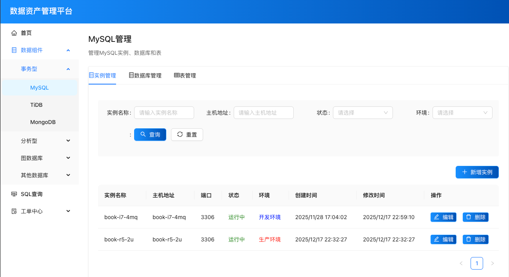
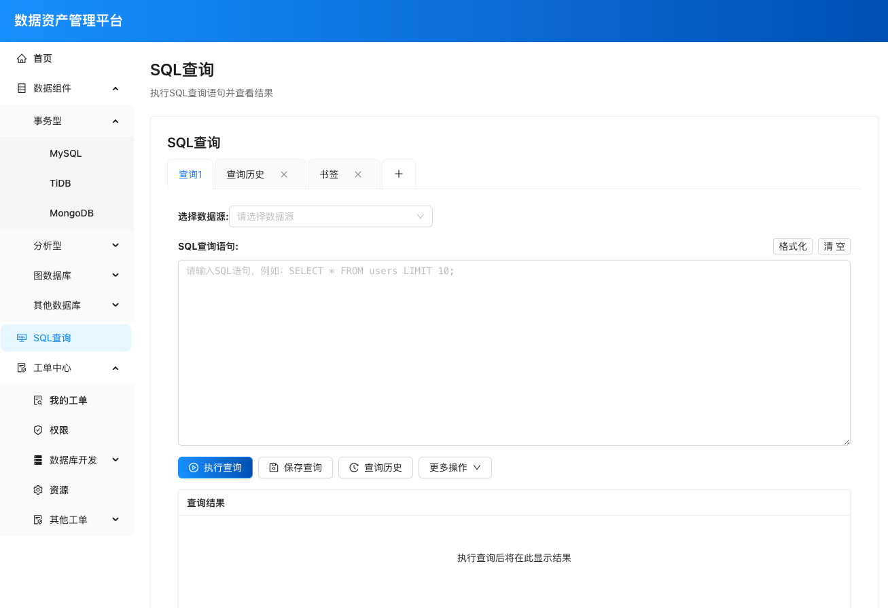
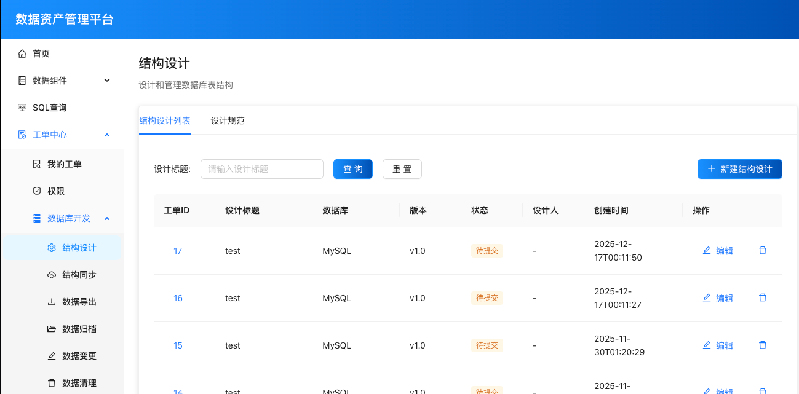
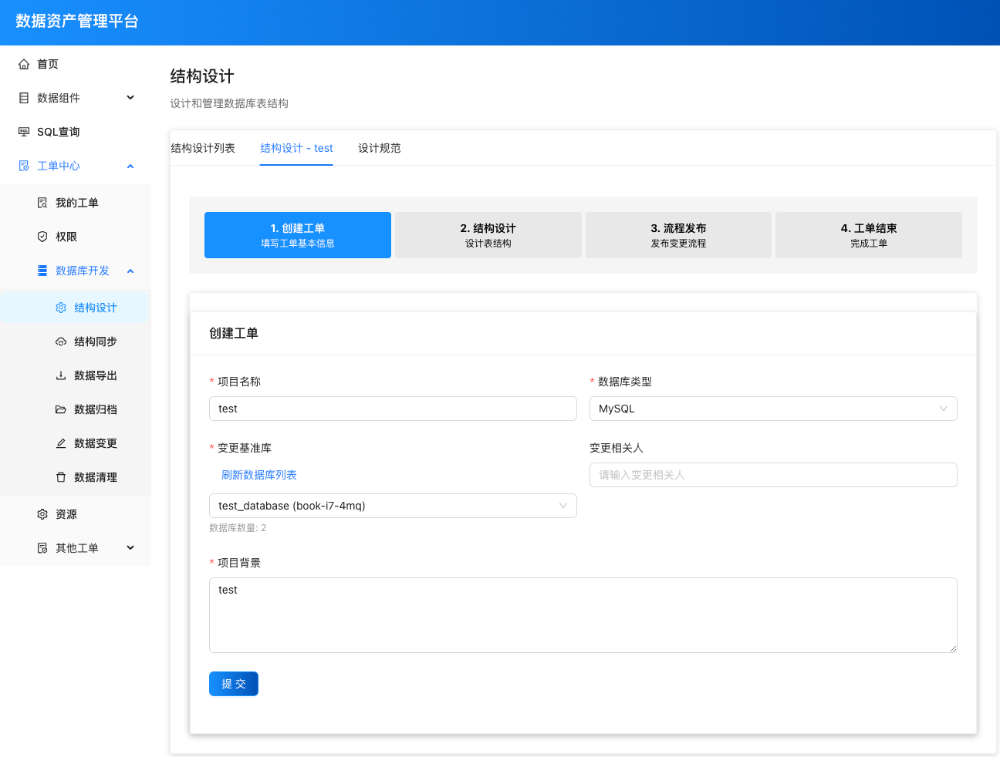
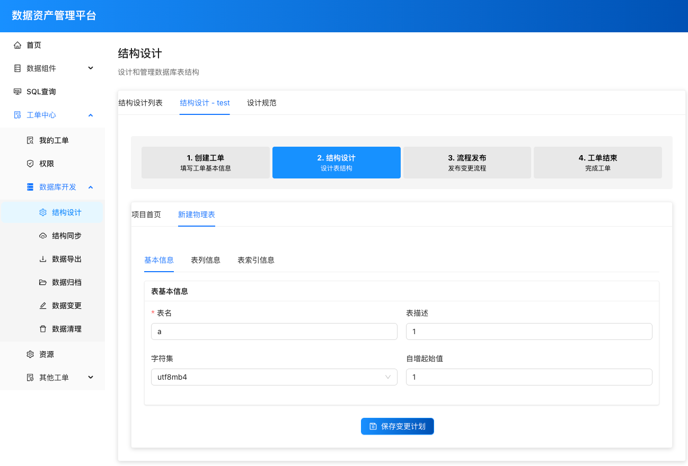
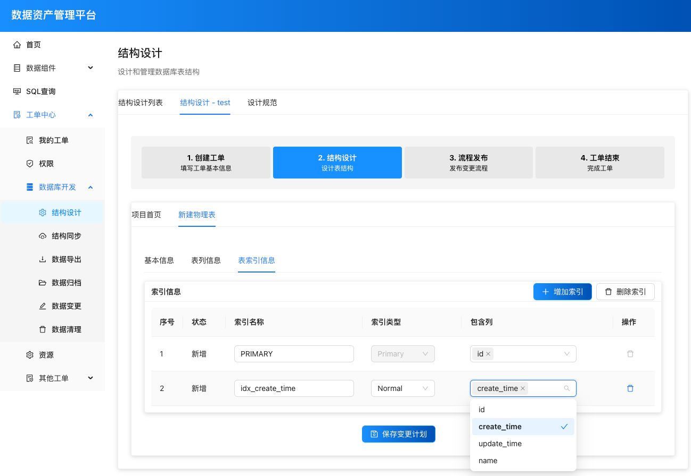
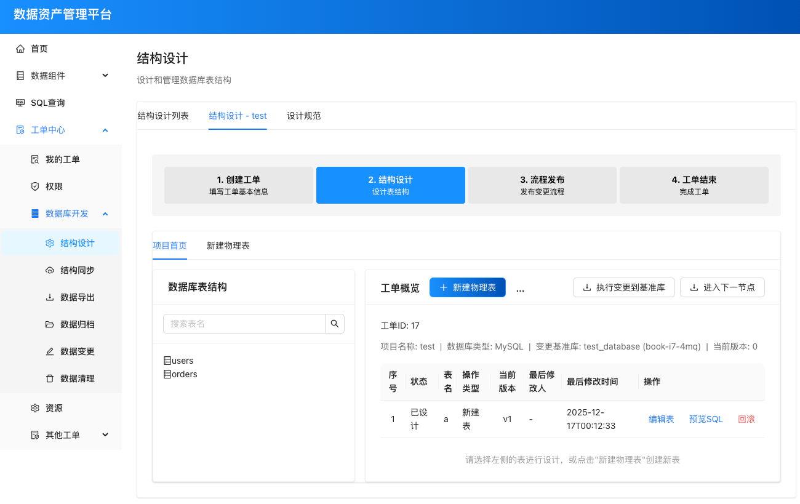
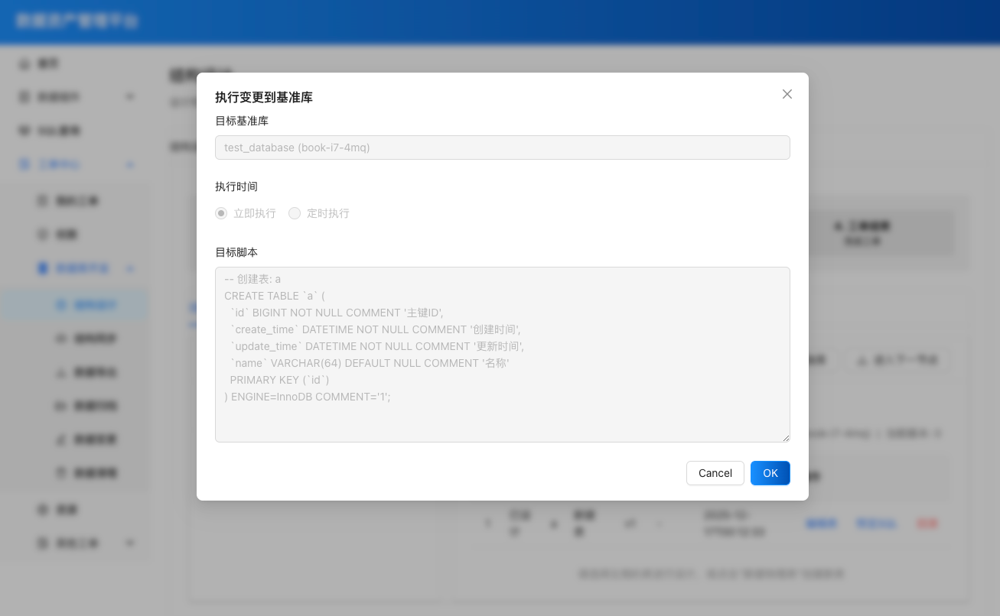

# 数据管理平台 (DMS - Database Management System)

## 项目概述

数据管理平台（DMS）是一个专门用于规范和管理业务使用数据库资源的企业级平台。该平台参考阿里巴巴DMS系统设计理念，提供统一的数据库管理界面，帮助企业更好地控制、监控和优化其数据库资源的使用。

本平台旨在为企业提供一站式数据库管理解决方案，通过标准化的操作流程和完善的权限控制，确保数据库资源的安全、高效使用。

## 主要功能

### 1. 数据库资源管理
- **实例管理**：统一管理各种类型的数据库实例（MySQL、TiDB、MongoDB、ClickHouse等）
- **数据库管理**：对数据库进行创建、删除、配置等操作
- **表结构管理**：可视化表结构设计和管理

### 2. 工单管理系统
- **结构设计工单**：数据库表结构变更申请和审批流程
- **权限管理工单**：数据库访问权限申请和管理
- **数据导出工单**：数据导出申请和审批
- **资源申请工单**：数据库资源申请和配置

### 3. 开发工具
- **SQL查询**：在线SQL查询工具
- **结构设计**：可视化数据库表结构设计工具
- **数据变更**：数据变更操作管理
- **数据清理**：定期数据清理任务配置

### 4. 监控与审计
- **操作日志**：记录所有数据库操作日志
- **权限审计**：跟踪权限变更历史
- **资源使用监控**：监控数据库资源使用情况

## 功能详情

### 1. MySQL实例、数据库、表管理
支持对数据库信息做增删改查操作。用户可以通过直观的界面管理MySQL实例、数据库和表，包括创建、修改、删除等操作。



### 2. SQL查询
统一管理用户的DQL及查询权限，提供在线SQL查询功能，支持多数据库查询和结果展示。



### 3. 结构设计工单
用于管理结构变更的DDL，包括：

- **工单列表**：展示所有结构设计工单的基本信息，支持筛选和搜索。



- **工单基本信息**：填写和编辑结构设计工单的基本信息，如工单名称、描述、优先级等。



- **表基本信息**：定义表的基本属性，如表名、注释等。



- **表列信息**：定义表的字段信息，包括字段名、类型、长度、是否为空、默认值等。


- **表索引信息**：管理表的索引，包括主键、唯一索引、普通索引等。



- **历史变更记录**：点击保存变更计划以后，可以在历史变更记录中查看所有变更记录。



- **执行变更到基准库**：点执行变更到基准库时，系统会展示执行计划和进度。



- **流程发布**：点击进入下一节点以后，工单进入流程发布阶段，完成最终审批和发布。


## 技术栈

### 后端技术栈
- **Java 17+**：主要开发语言
- **Spring Boot 3.x**：应用框架
- **Spring Security**：安全认证和授权
- **MyBatis Plus**：ORM框架
- **MySQL**：主要数据存储
- **Maven**：项目构建工具

### 前端技术栈
- **React 18+**：主要前端框架
- **Ant Design**：UI组件库（参考阿里云DMS界面设计风格）
- **React Router v6**：路由管理
- **Axios**：HTTP客户端
- **Vite**：构建工具

## 项目架构

```
dms/
├── dms-front/          # 前端项目
│   ├── src/            # 源代码
│   │   ├── components/ # 公共组件
│   │   ├── pages/      # 页面组件
│   │   ├── services/   # API服务
│   │   └── utils/      # 工具函数
│   └── package.json    # 前端依赖配置
├── dms-server/         # 后端项目
│   ├── src/            # 源代码
│   │   ├── main/
│   │   │   ├── java/   # Java源代码
│   │   │   │   └── com.arelore.dmsserver/
│   │   │   │       ├── controller/  # 控制器层
│   │   │   │       ├── service/     # 服务层
│   │   │   │       ├── entity/      # 实体类
│   │   │   │       ├── dto/         # 数据传输对象
│   │   │   │       └── mapper/      # 数据访问层
│   │   │   └── resources/          # 资源文件
│   │   │       ├── db/              # 数据库脚本
│   │   │       └── application.yml  # 配置文件
│   │   └── test/       # 测试代码
│   └── pom.xml         # Maven配置文件
└── README.md           # 项目说明文档
```

## 核心模块

### 1. 数据组件管理
- **事务型数据库**：MySQL、TiDB、MongoDB
- **分析型数据库**：ClickHouse、Elasticsearch、StarRocks
- **图数据库**：Gbase、Nebula
- **其他数据库**：Milvus、HBase、TSDB

### 2. 工单中心
- **我的工单**：个人相关的工单管理
- **权限管理**：数据库权限申请和审批
- **数据库开发**：
  - 结构设计
  - 结构同步
  - 数据导出
  - 数据归档
  - 数据变更
  - 数据清理
- **资源管理**：数据库资源申请
- **其他工单**：数据库密码申请等

### 3. SQL查询工具
- 在线SQL编辑器
- 查询结果展示
- 查询历史记录
- 多数据库支持

## 设计理念

本平台参考阿里巴巴DMS系统的设计理念和用户体验，致力于提供：
- **简洁直观的操作界面**：降低用户学习成本
- **标准化的业务流程**：通过工单系统规范数据库操作
- **完善的权限管理体系**：确保数据安全
- **高效的开发工具**：提升数据库开发效率

## 项目特点

1. **统一管理**：提供统一的数据库资源管理界面
2. **流程规范**：通过工单系统规范数据库操作流程
3. **安全保障**：完善的权限控制和操作审计
4. **易于扩展**：模块化设计，支持多种数据库类型
5. **用户体验**：现代化的前端界面，操作简便（参考阿里云DMS设计风格）

## 适用场景

- 企业数据库资源统一管理
- 数据库操作流程规范化
- 数据库权限精细化控制
- 数据库使用情况监控和审计
- 多种数据库类型的统一管理平台